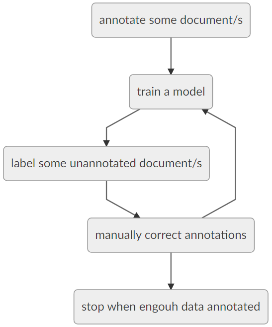

# SEM tutorial

This tutorial aims at showing you how to use the SEM annotation GUI to produce annotated data and models you can use to annotate textual content.

This tutorial will make you annotate some french food recipes gathered from [750g](https://www.750g.com/). If you do not understand french (and even if you do), some annotations are provided in case of doubt (in `reference`), you can use those as cheat sheets. If you are allergic to french, you are welcome to create a tutorial in another language.

# Before you do anything here...

... here are the first steps you need to follow:

- install [SEM](https://github.com/YoannDupont/SEM);
- copy the content of `sem_data` to whatever location you local SEM installation uses (typically `~/sem_data`).

# Launch the interface

You can now just launch the annotation interface!

`python -m sem annotation_gui`

Or, if want everything to be loaded at startup:

`python -m sem annotation_gui -t ~/sem_data/resources/tagsets/cuisine.txt -d raw/*.txt`

If you did not annotate everything and want to finish later, see the [saving your work](#saving-your-work) section.

# If you want to load everything in the interface

- First (very important, it will not work otherwise), load the "cuisine.txt" tagset: `File ==> load tagset` or `Alt+f ==> t`;
- Second, load documents: `File ==> open...` or `Ctrl+o` and select documents in the "raw" folder.

It is a good idea to do those steps in this order. If you load BRAT files, SEM will use the name of the loaded tagset to create his own (and use NER as a default value). Tagset names are important, training can/will fail if names are wrong.

# Annotation/Training loop

You will now be annotating, training and using a trained tagger to create an annotated corpus. The overall process looks like this:

This is poor man's [active learning](https://en.wikipedia.org/wiki/Active_learning_(machine_learning)). The process is the same as in active learning, but lacks the very critical computation of the best unseen example to best improve quality in the next training step.

SEM has a [manual](https://github.com/YoannDupont/SEM/tree/master/manual) in [French](https://github.com/YoannDupont/SEM/blob/master/manual/manual-fr.pdf) (also translated in [English](https://github.com/YoannDupont/SEM/blob/master/manual/manual-en.pdf)) to explain you how to annotate and train new models, use it if you wonder what to do.

## Train a new model

When you finished annotating a document, you may want to train a new model to produce a candidate annotation for you. To open the training popup, you can click on the `train` button in the upper left corner (at the time of writing this) or `Ctrl+t`, then:

- for `document filter` choose `only documents with annotations`;
- for `select workflow` click on `cuisine.xml`;
- click on the `train` button in the bottom of the window to launch the training (neural networks are not in SEM... yet).

The model should be automaticaly copied to the right location, but if it is not the case, please follow the steps in the manual.

## Label a document

After training a model, you need to systematicaly load the worklow again (the model update in a loaded worflow is not automatic). To do that `File ==> load master` or `Alt+f ==> m` and choose the `cuisine.xml` workflow.

Once loaded the `tag document` button should become clickable. To tag a document, simply select a document without annotations and click on `tag document` button in the upper left corner (at the time of writing this). If you do not have any annotation, well, tough luck.

## Saving your work

If you wish to save your work to reload it later: `Alt+f ==> save as.. ==> BRAT corpus` or `Alt+f ==> a ==> b` and choose save in the `annotated` folder. You can then load it with the following command line:

`python -m sem annotation_gui -t ~/sem_data/resources/tagsets/cuisine.txt -d annotated/*.ann`

# That's all folks!

That is a lot of text, but once you did it a couple times, you should be able to do it very quickly. If you feel like some explanation is missing to understand this tutorial, you are welcome to open an issue.

Thank you for using/trying SEM!
